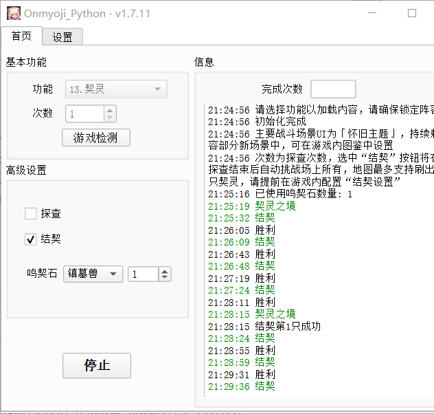

# Onmyoji_Python


[](https://github.com/AquamarineCyan/Onmyoji_Python/releases/latest)

## 简介

本项目仅支持阴阳师桌面版使用，使用过程中会占用鼠标，桌面版需前置（可使用游戏自带的置顶功能）

## 主要功能

1. 御魂副本
   - 组队/单人
   - 组队司机/打手
   - 十层/悲鸣/神罚
2. 组队永生之海副本
    - 仅适用于组队中
    - 适配司机/打手
3. 业原火副本
4. 御灵副本
5. 个人突破
    - 3胜刷新
    - 锁定阵容
6. 寮突破
    - 锁定阵容，从上至下进攻
7. 道馆突破
    - 等待系统进入/手动挑战/正在进行中
    - 挂机阵容
8. 普通召唤
    - 清票/狗粮
9. 百鬼夜行
   - 清票
   - 截图，默认启用
10. 限时活动
11. 组队日轮副本
12. 个人探索
13. 契灵 🚧
14. 觉醒副本

## 下载安装

1. **推荐** 应用程序运行

    - 前往最新版 [releases](https://github.com/AquamarineCyan/Onmyoji_Python/releases/latest) 下载解压打包完成的应用程序，解压即用

    - 阴阳师桌面版 [提供NGA下载地址](https://nga.178.com/read.php?tid=29661629)

    - 本项目 [releases](https://github.com/AquamarineCyan/Onmyoji_Python/releases)
    
    - 备选下载链接 [releases[gitee]](https://gitee.com/AquamarineCyan/Onmyoji_Python/releases)
    > [! NOTE]
    >  
    > 由于`gitee`的`releases`存在100M大小的限制，该链接提供的是增量包。\
    如果遇到根目录下没有`ocr`文件夹，使用程序内自带的`ghproxy`更新下载，或者手动下载本项目[releases](https://github.com/AquamarineCyan/Onmyoji_Python/releases)即可。

2. <details><summary> 源码编译运行 </summary>

     需要一定的基础，更新较勤，可能存在bug

   1. 使用 `git` 命令下载源码  
      ```bash
      git close https://ghproxy.com/https://github.com/AquamarineCyan/Onmyoji_Python.git --depth=1 --single-branch
      ```
      后续只需 `git pull`

   2. 安装依赖 
      - venv 方式  
        `pip install -r requestments.txt`
      - poetry 方式  
        `poetry install`

   3. 运行
      - 自行打包，需要poetry环境，打包配置已存在 `main.spec`  
        - 终端运行 `pyinstaller main.spec`
        - 或者运行 `build.bat`
      - 或者不打包，直接运行（理论上能够生成UI）  
     `python main.py`

  </details>

## 程序目录

```
   |- data # 用户数据
      |- myresource # 自定义素材，用法见(#注意事项)
      |- screenshot # 截图
      |- config.yaml # 配置文件
      |- update_info.json # 更新记录
   |- lib # 运行库
   |- log # 日志
   |- ocr # 文字识别库
   |- resource # 素材文件
```

## 主界面



- 功能模块
    - 1.御魂副本
    - 2.组队永生之海副本
    - 3.业原火副本
    - 4.御灵副本
    - 5.个人突破
    - 6.寮突破
    - 7.道馆突破
    - 8.普通召唤
    - 9.百鬼夜行
    - 10.限时活动
    - 11.组队日轮副本
    - 12.单人探索
    - 13.契灵
- 游戏检测
    - 手动更新游戏窗口信息，适合窗口移动，或双开
- 中途停止
- 设置
    - 更新模式
      - 自动更新/关闭
    - 下载线路
      - ghproxy/GitHub/Gitee
    - 悬赏封印
      - 接受/拒绝/忽略/关闭
    - 界面风格
      - Windows/Fusion
    - 记忆上次所选功能

## 使用方法

**请自行合理使用，所产生的一切后果自负**

1. 受限于图像识别技术，目前仅支持默认的2种战斗主题，文字识别在测试中。

2. 移动游戏窗口后，会自动更新窗口。多开游戏的话，还是需要手动点击`游戏检测`，会检测位于较上层的游戏。

3.  如果需要自定义识别的素材，可参考`resource`下的分类方法，在`/data/myresource`给出相同路径的素材即可。

    例如需要使用自定义的`/resource/huodong/title.png`文件，则新建`/data/myresource/huodong/title.png`即可。程序将优先使用用户给定的自定义素材。

## 更新记录

[CHANGELOG.MD](CHANGELOG.MD)
